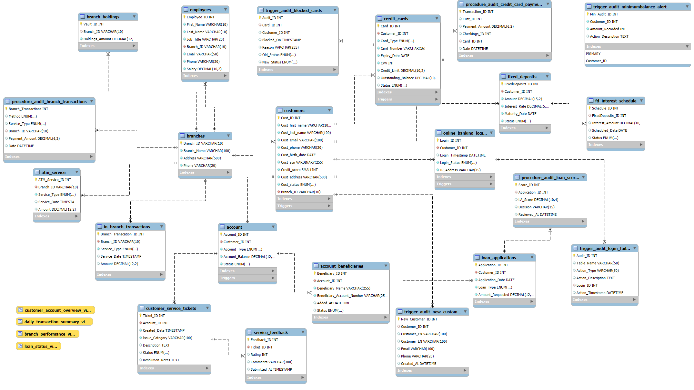

# FinTrustBank-Database

-- 

## Project Overview and Details 

-- 

-- ➡️[Project Overview and Details](Project_Overview_&_Details.md)

## Queries and Output

--

-- ➡️[Queries and Output](Queries_with_Output.md)

## Entity Relationship Diagram (ERD)

## How to Run 

-- 1. Run 'schema_and_inserts.sql' to create tables and populate with inserts.
-- 2. Run 
